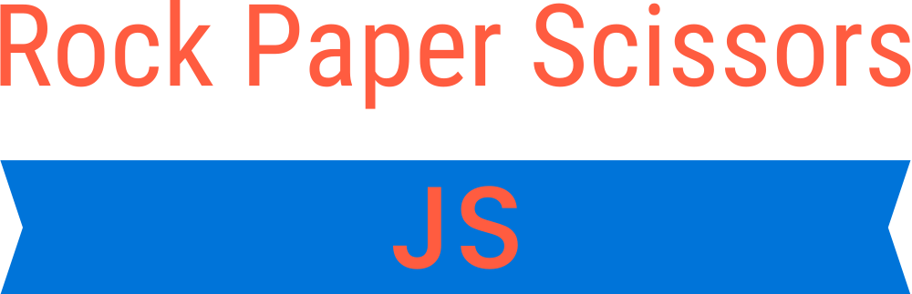

<div align="center">
    
</div>
<br>
<div align="center">

[](https://opensource.org/licenses/)


</div>

---

<p align="center"> The classical game Rock, Paper and Scissors developed with JS
    <br> 
</p>

## 📝 Table of Contents

- [About](#about)
- [Getting Started](#getting_started)
- [Deployment](#deployment)
- [Usage](#usage)
- [Built Using](#built_using)
- [Authors](#authors)
- [Acknowledgments](#acknowledgement)

## 🧐 About <a name = "about"></a>

I made this game to practice Javascript following the requirements in the [Odin Project Lesson](https://www.theodinproject.com/lessons/foundations-rock-paper-scissors)

## Getting Started <a name = "getting_started"></a>

Users should be able to:

- View the optimal layout for the game depending on their device's screen size
- Play Rock, Paper, Scissors against the computer
- Maintain the state of the score after refreshing the browser _(optional)_
- **Bonus**: Play Rock, Paper, Scissors, Lizard, Spock against the computer _(optional)_

## 🚀 Deployment <a name = "deployment"></a>

To deploy this page to GitHub Pages from its [GitHub repository](https://github.com/maxthor500/rock-paper-scissors), the following steps were taken:

1. Log into GitHub.
2. From the list of repositories on the screen, select **maxthor500/rock-paper-scissors.
3. From the menu items near the top of the page, select **Settings**.
4. Scroll down to the **GitHub Pages** section.
5. Under **Source** click the drop-down menu labelled **None** and select **Master Branch**
6. On selecting Master Branch the page is automatically refreshed, the website is now deployed.
7. Scroll back down to the **GitHub Pages** section to retrieve the link to the deployed website.

**How to run this project locally**

To work on the project code within a local IDE such as VSCode, Pycharm etc:

1. Follow this link to the [project GitHub repository](https://github.com/maxthor500/rock-paper-scissors).
2. Under the repository name, click "Clone or download".
3. In the Clone with SSH section, copy the clone URL for the repository.
4. In your local IDE open the terminal.
5. Change the current working directory to the location where you want the cloned directory to be made.
6. Type `git clone`, and then paste the URL you copied in Step 3.

```
git clone https://github.com/USERNAME/REPOSITORY
```

1. Press Enter. Your local clone will be created.

Further reading and troubleshooting on cloning a repository from GitHub [here](https://help.github.com/en/articles/cloning-a-repository).

## Usage

## Design

- [Design wireframes PDF](./assets/wireframe/Rock_Paper_Scissors_Wireframe.pdf)


**Images**

- [Logo](https://app.logo.com/)

## ⛏️ Built Using <a name = "built_using"></a>

- [HTML5](https://html.com/html5/)
- [CSS3](https://developer.mozilla.org/en-US/docs/Web/CSS)
- [Git Version Control](https://git-scm.com/)
- [GitHub](https://github.com/)
- [Javascript](https://developer.mozilla.org/en-US/docs/Web/javascript)
- [Logo Maker](https://app.logo.com/)
- [Figma](https://www.figma.com)

## ✍️ Authors <a name = "authors"></a>

- [maxthor500](https://github.com/maxthor500/)

## 🎉 Acknowledgements <a name = "acknowledgement"></a>

- Inspiration: Odin Project
- Starting from Design Figma by [@lamigenius](https://www.figma.com/@lamigenius)
